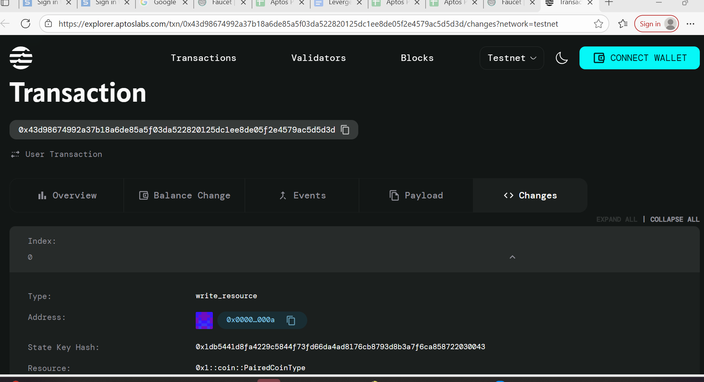

Token Swap Contract
Project Title
Token Swap Contract - A Simple 1:1 Token Exchange Mechanism on Aptos

Project Description
This project implements a basic decentralized token swap mechanism on the Aptos blockchain that enables users to exchange tokens at a fixed 1:1 ratio. The smart contract provides a simple and secure way for users to swap between two different token types through a liquidity pool system. Users can create swap pools with initial liquidity and perform token exchanges seamlessly.

Project Vision
Our vision is to create a foundational building block for decentralized finance (DeFi) on the Aptos ecosystem by providing a simple, secure, and efficient token swapping mechanism. We aim to:

Democratize Token Exchange: Enable anyone to create and participate in token swaps without intermediaries
Foster Innovation: Provide a base template that developers can extend for more complex DeFi applications
Enhance Liquidity: Create multiple swap pools that increase overall token liquidity in the Aptos ecosystem
Promote Accessibility: Offer a user-friendly interface for token swapping that doesn't require deep technical knowledge
Key Features
🔄 Simple 1:1 Swap Mechanism
Direct token-to-token exchange at a fixed 1:1 ratio
No complex pricing algorithms or slippage calculations required
🏊 Liquidity Pool Creation
Users can create new swap pools between any two token types
Initial liquidity provision during pool creation
Pool ownership and management system
⚡ Efficient Operations
Only two main functions: create_pool and swap_a_to_b
Minimal gas consumption for swap operations
Built on Aptos's high-performance blockchain
🛡️ Security Features
Built-in error handling for insufficient balances
Pool existence verification
Secure token transfer mechanisms using Aptos framework
🔧 Developer Friendly
Clean, readable code structure
Comprehensive error codes and messages
Easy to extend and customize
Future Scope
Phase 2 - Enhanced Functionality
Dynamic Pricing: Implement automated market maker (AMM) algorithms
Multiple Token Support: Enable multi-token swap pools
Liquidity Mining: Reward system for liquidity providers
Fee Structure: Implement swap fees and revenue sharing
Phase 3 - Advanced Features
Governance System: Community-driven protocol upgrades
Cross-chain Bridges: Enable swaps across different blockchains
Flash Loans: Instant, collateral-free loans for arbitrage
Analytics Dashboard: Real-time pool statistics and trading data
Phase 4 - Ecosystem Integration
Mobile Application: User-friendly mobile interface
API Integration: Third-party application integration
Institutional Tools: Advanced trading features for institutions
Educational Platform: Learning resources for DeFi newcomers
Contract Details
[This section will be filled by the developer with specific implementation details, deployment addresses, and technical specifications]

Quick Start Guide
Prerequisites
Aptos CLI installed
Move compiler setup
Testnet/Mainnet wallet configured
Deployment
bash
# Clone the repository
git clone <repository-url>
cd token-swap-contract

# Compile the contract
aptos move compile

# Deploy to testnet
aptos move publish --profile testnet
Usage Example
move
// Create a new swap pool
MyModule::TokenSwap::create_pool<TokenA, TokenB>(owner, 1000, 1000);

// Swap Token A for Token B
MyModule::TokenSwap::swap_a_to_b<TokenA, TokenB>(user, pool_owner, 100);
Built with ❤️ on Aptos Blockchain

0x43d98674992a37b18a6de85a5f03da522820125dc1ee8de05f2e4579ac5d5d3d

